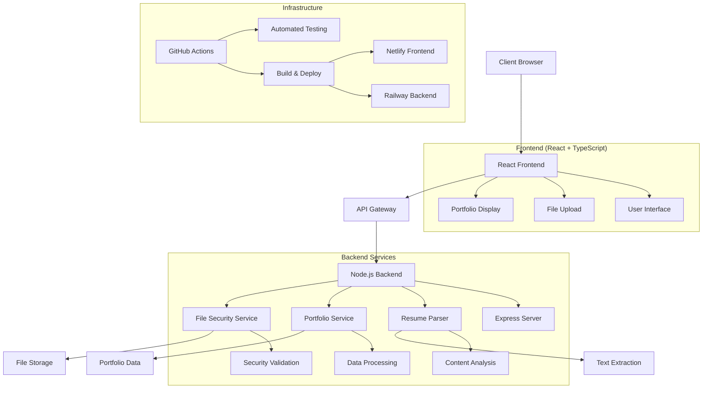

# Portfolio Builder 🚀

> A modern, full-stack portfolio generation platform built with TypeScript, React, and Node.js

[](https://github.com/blanchardsw/portfolio-builder/actions)
[](https://www.typescriptlang.org/)
[](https://reactjs.org/)
[](https://nodejs.org/)
[](LICENSE)

## ✨ Features

- 🎨 **Dynamic Portfolio Generation** - Automatically generate professional portfolios from resume data
- 🔒 **Secure File Upload** - Multi-layer security validation for resume uploads (PDF, DOCX, DOC, TXT)
- 🧪 **Comprehensive Testing** - 90%+ test coverage with Jest and React Testing Library
- 🚀 **CI/CD Pipeline** - Automated testing, building, and deployment with GitHub Actions
- 📱 **Responsive Design** - Modern UI/UX that works seamlessly across all devices
- 🔍 **Resume Parsing** - Advanced text extraction and content analysis capabilities
- ⚡ **Performance Optimized** - Fast loading times with optimized bundling and caching
- 🛡️ **Security First** - File signature validation, content scanning, and threat detection

## 🏗️ Architecture



## 🗂️ Project Structure

```text
📁 portfolio-builder/
├── 📦 portfolio-frontend/           # React TypeScript frontend
│   ├── src/
│   │   ├── components/              # Reusable UI components
│   │   ├── services/                # API integration layer
│   │   ├── types/                   # TypeScript type definitions
│   │   ├── utils/                   # Utility functions
│   │   └── __tests__/               # Component tests
│   ├── public/                      # Static assets
│   └── build/                       # Production build output
├── 🧩 portfolio-backend/            # Node.js Express backend
│   ├── src/
│   │   ├── routes/                  # API route handlers
│   │   ├── services/                # Business logic services
│   │   ├── types/                   # Shared type definitions
│   │   ├── utils/                   # Backend utilities
│   │   └── __tests__/               # Service & integration tests
│   ├── uploads/                     # File upload directory
│   └── dist/                        # Compiled JavaScript output
├── 🛠️ scripts/                      # Development & build scripts
├── ⚙️ .github/workflows/            # CI/CD pipeline configuration
└── 📋 package.json                  # Monorepo configuration
```

## 🛠️ Technology Stack

### Frontend
- **React 18** - Modern React with hooks and concurrent features
- **TypeScript** - Type-safe JavaScript for better development experience
- **CSS3** - Custom styling with modern CSS features
- **Jest & React Testing Library** - Comprehensive testing framework

### Backend
- **Node.js 18+** - JavaScript runtime for server-side development
- **Express.js** - Fast, unopinionated web framework
- **TypeScript** - Type safety across the entire stack
- **Multer** - File upload handling middleware
- **Jest** - Unit and integration testing

### DevOps & Infrastructure
- **GitHub Actions** - CI/CD pipeline automation
- **Netlify** - Frontend hosting and deployment
- **Railway** - Backend hosting and deployment
- **npm Workspaces** - Monorepo package management

## 🚀 Quick Start

### Prerequisites

- **Node.js** ≥ 18.0.0
- **npm** ≥ 8.0.0
- **Git** for version control

### Installation

1. **Clone the repository**
   ```bash
   git clone https://github.com/blanchardsw/portfolio-builder.git
   cd portfolio-builder
   ```

2. **Install dependencies for both frontend and backend**
   ```bash
   npm run install:all
   ```

3. **Set up environment variables**
   ```bash
   # Backend environment
   cp portfolio-backend/.env.example portfolio-backend/.env
   
   # Frontend environment  
   cp portfolio-frontend/.env.example portfolio-frontend/.env
   ```

4. **Start the development servers**
   ```bash
   npm run dev
   ```

   This will start:
   - Frontend: http://localhost:3000
   - Backend: http://localhost:3001

## 🧪 Testing

The project includes comprehensive test suites for both frontend and backend:

```bash
# Run all tests
npm test

# Run tests with coverage
npm run test:coverage

# Run tests in watch mode
npm run test:watch

# Run only backend tests
npm run test:backend

# Run only frontend tests
npm run test:frontend
```

### Test Coverage
- **Backend**: 90%+ coverage including unit and integration tests
- **Frontend**: 85%+ coverage with component and utility tests
- **Security**: Comprehensive file upload security testing

## 📚 API Documentation

### Core Endpoints

#### Portfolio Management
```http
GET /api/portfolio
Content-Type: application/json

Response: Portfolio data with personal info, experience, education, etc.
```

#### File Upload
```http
POST /api/upload
Content-Type: multipart/form-data

Body: { file: <resume-file> }
Response: { success: true, filename: string, analysis: object }
```

#### Health Check
```http
GET /api/health
Response: { status: "healthy", timestamp: string }
```

For detailed API documentation, see the [API Reference](./docs/api/) (coming soon).

## 🚀 Deployment

### Production Deployment

The application is configured for deployment on:
- **Frontend**: Netlify (automatic deployment from main branch)
- **Backend**: Railway (automatic deployment from main branch)

### Environment Configuration

**Backend (.env)**
```env
NODE_ENV=production
PORT=3001
CORS_ORIGIN=https://your-frontend-domain.netlify.app
UPLOAD_DIR=./uploads
MAX_FILE_SIZE=10485760
```

**Frontend (.env)**
```env
REACT_APP_API_URL=https://your-backend-domain.railway.app
REACT_APP_ENVIRONMENT=production
```

## 🏗️ Development

### Project Scripts

```bash
# Development
npm run dev              # Start both frontend and backend
npm run dev:frontend     # Start only frontend
npm run dev:backend      # Start only backend

# Building
npm run build            # Build both applications
npm run build:frontend   # Build only frontend
npm run build:backend    # Build only backend

# Testing
npm test                 # Run all tests
npm run test:coverage    # Run tests with coverage
npm run test:watch       # Run tests in watch mode

# Linting & Formatting
npm run lint             # Lint all code
npm run format           # Format all code
npm run type-check       # TypeScript type checking

# Maintenance
npm run clean            # Clean build artifacts
npm run audit            # Security audit
```

### Code Quality

- **ESLint** - Code linting with TypeScript support
- **Prettier** - Code formatting
- **Husky** - Git hooks for pre-commit validation
- **TypeScript** - Static type checking
- **Jest** - Testing framework

## 🔒 Security Features

### File Upload Security
- **File Signature Validation** - Verifies actual file type vs MIME type
- **Content Scanning** - Detects malicious patterns and executable content
- **Size Limits** - Enforces file size constraints (100 bytes - 10MB)
- **Quarantine System** - Isolates suspicious files
- **Allowed Types** - Restricts to PDF, DOCX, DOC, TXT only

### Application Security
- **CORS Configuration** - Proper cross-origin resource sharing
- **Input Validation** - Sanitizes all user inputs
- **Error Handling** - Secure error responses without information leakage
- **Environment Variables** - Sensitive data stored securely

## 🤝 Contributing

Contributions are welcome! Please follow these steps:

1. **Fork the repository**
2. **Create a feature branch**
   ```bash
   git checkout -b feature/amazing-feature
   ```
3. **Make your changes**
4. **Add tests** for new functionality
5. **Run the test suite**
   ```bash
   npm test
   ```
6. **Commit your changes**
   ```bash
   git commit -m 'Add amazing feature'
   ```
7. **Push to your branch**
   ```bash
   git push origin feature/amazing-feature
   ```
8. **Open a Pull Request**

### Development Guidelines
- Follow TypeScript best practices
- Write comprehensive tests
- Use meaningful commit messages
- Update documentation as needed
- Ensure all CI checks pass

## 📄 License

This project is licensed under the MIT License - see the [LICENSE](LICENSE) file for details.

## 🙏 Acknowledgments

- Built with modern web technologies and best practices
- Inspired by the need for developer portfolio automation
- Thanks to the open-source community for excellent tools and libraries

## 📞 Contact

**Stephen Blanchard**
- GitHub: [@blanchardsw](https://github.com/blanchardsw)
- LinkedIn: [Stephen Blanchard](https://linkedin.com/in/stephen-blanchard)
- Email: stephen.blanchard@example.com

---

<div align="center">
  <strong>⭐ Star this repository if you find it helpful!</strong>
</div>
```
